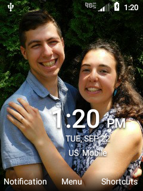
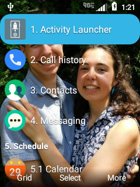
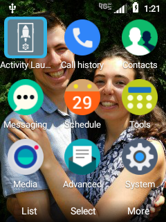
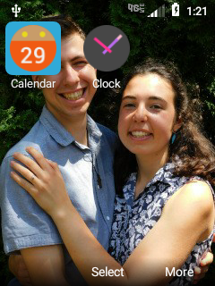
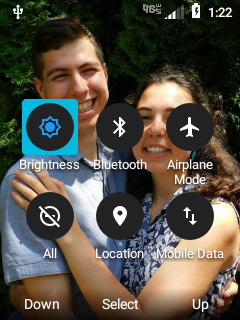

# FlipPhoneLauncher

A minimal Android home-screen launcher built for flip phones and other keypad or D-pad
devices without a touchscreen. Everything is driven by the number keys, D-pad, OK/center,
and the two softkeys. Targets Android 8 (API 26) and up.

## Screenshots

<table>
  <tr>
    <td align="center">Home<br></td>
    <td align="center">App Menu — list<br></td>
    <td align="center">App Menu — grid<br></td>
  </tr>
  <tr>
    <td align="center">Folder<br></td>
    <td align="center">Shortcuts<br></td>
    <td></td>
  </tr>
</table>

## Screens

**Home.** Shows the time, date, and carrier name. Softkeys: left opens notifications,
middle (OK) opens the App Menu, right opens the Shortcuts menu.

- Number and `*` keys open the dialer pre-filled with that digit. `#` dials `#`; long-press
  `#` toggles vibrate.
- Each D-pad direction can launch an assigned app. Hold OK and press a direction to pick the
  app for that direction (the picker includes a "Recent Apps" entry).
- The call key opens the recent-calls log.

**App Menu (OK from Home).** Lists installed apps grouped into folders. Toggle between list
and grid with the left softkey; the choice is remembered. Apps are numbered by folder, so
pressing a number jumps to or launches an app. The right softkey opens the selected app's
system settings. A folder with a single app launches it directly; a folder with several apps
opens a folder grid.

**Folder Menu.** A grid of the apps in one folder. Number keys launch, the right softkey
opens app settings, and Back returns to the App Menu.

**Shortcuts (right softkey from Home).** A 3x2 grid of quick toggles navigated with the
D-pad: Mobile Data, Bluetooth, Airplane Mode, Do Not Disturb, Location, and Brightness.
Bluetooth, Do Not Disturb, and Brightness act directly; Location toggles too when the extra
permission below is granted. Mobile Data and Airplane Mode open the matching settings screen
(Android blocks third-party apps from switching those directly), and a long-press on any tile
opens its settings screen.

## Configuration

- App-to-folder assignments come from `app/src/main/assets/starter_config.json` the first
  time an app is seen.
- The live layout is persisted to `launcher_config.json` in the app's external files
  directory, so it survives restarts.

## Permissions

Some toggles need special access that Android grants outside the normal permission prompt:

- **Modify system settings** (`WRITE_SETTINGS`) for the brightness control.
- **Do Not Disturb access** for the DnD toggle.

The app requests these the first time you use the relevant control and sends you to the right
settings screen if access is missing.

### Location toggle: `WRITE_SECURE_SETTINGS`

The Location tile toggles GPS on/off directly, which needs `WRITE_SECURE_SETTINGS`. This is a
system permission that can't be granted by the normal prompt or by signing the app with your
own key. Grant it once over adb:

```sh
adb shell pm grant com.ham.flipphonelauncher android.permission.WRITE_SECURE_SETTINGS
```

Without it, the Location tile safely falls back to opening the Location settings screen.

Notes:

- The grant **survives app updates** (`adb install -r`) but is **lost on uninstall**. Reinstalling
  a build signed with a different key forces an uninstall first, which wipes it — re-run the
  command above afterward.
- To keep the grant across builds, always sign with the **same key** so every install is an
  in-place update, never an uninstall.
- Signing alone cannot grant this permission. The only ways to hold it without adb are to
  platform-sign the app (custom ROM) or install it as a privileged system app under
  `/system/priv-app` with a `privapp-permissions` allowlist entry (requires root).
- Airplane Mode and Mobile Data can't be toggled even with this permission (the airplane radio
  switch needs a system-protected broadcast; mobile data needs a signature-level permission), so
  those tiles open their settings screens.

## Building

Standard Android Gradle project:

```sh
./gradlew assembleDebug
adb install app/build/outputs/apk/debug/app-debug.apk
```
